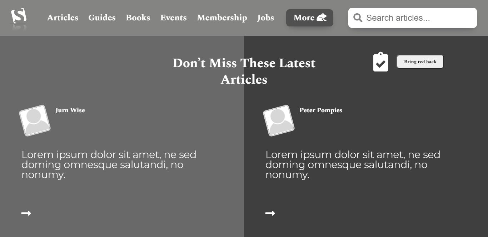

# Smashing-Magazine-Heatmap
> This project consists of building a heatmap of the [Smashing Magazine website](https://www.smashingmagazine.com/).



## Project Requirements

### General
- You can find the original project specification at [The Odin Project](https://www.theodinproject.com/courses/html5-and-css3/lessons/design-teardown).

### Specific to Microverse
- Align all elements with ```float``` and ```flex``` or ```grid```.
- Use ```article tag``` for all articles listed on the page.
- Make sure to build your layout using a width of 1440px on the original page. You can use the Developer Tools to match that screen size.

## Built With

- HTML
- CSS

## Dependencies

> Refer to [Linters Config](https://github.com/eananti/linters-config/tree/master/html-css) for project setup guide.

## Live Demo

[Live Demo Link](https://ceejayski.github.io/Old-Apple-Website-Clone/)

## Authors

👤 **Author1**

- Github: [@eananti](https://github.com/eananti)
- Twitter: [@e_ananti](https://twitter.com/e_ananti)
- Linkedin: [Emeka Ananti](https://www.linkedin.com/in/emekaananti/)

👤 **Author2**

- Github: [@Ceejayski](https://github.com/ceejayski)
- Twitter: [@Ceejaski1](https://twitter.com/Ceejayski1)
- Linkedin: [Okoli Chijioke](https://www.linkedin.com/in/okolichijioke/)

## Show your support

Give a ⭐️ if you like this project!
